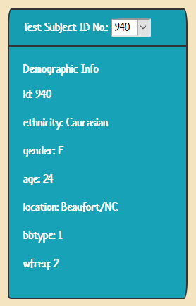
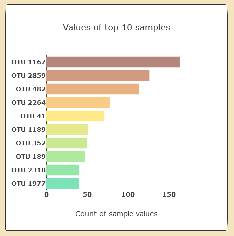
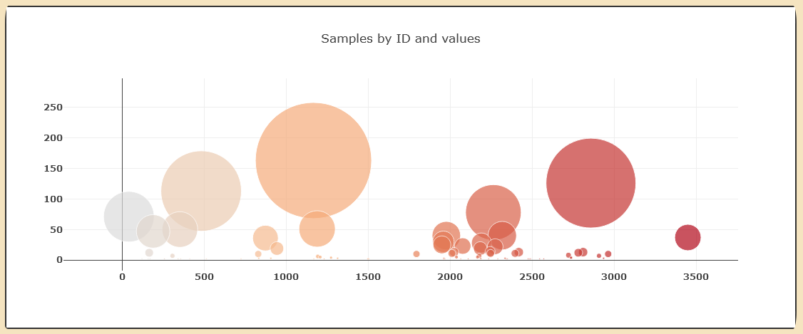
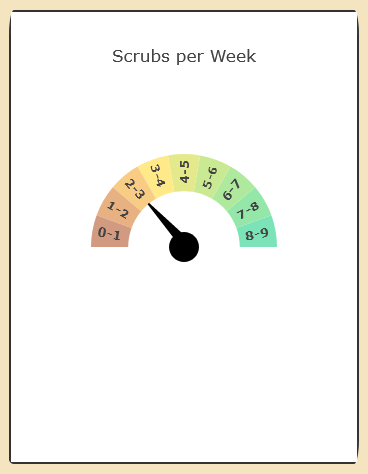
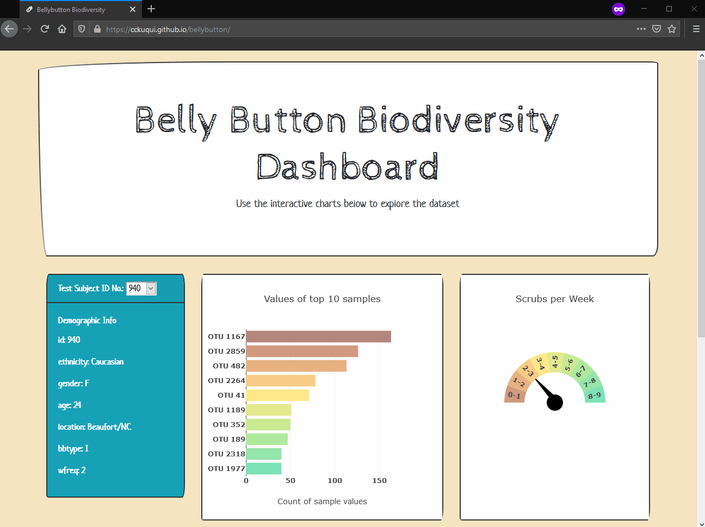

# [Belly Button Biodiversity](https://cckuqui.github.io/bellybutton/)

## Data 

For this exercise it was used the [Belly Button Biodiversity dataset](http://robdunnlab.com/projects/belly-button-biodiversity/), which catalogs the microbes that colonize human navels.

The dataset reveals that a small handful of microbial species (also called operational taxonomic units, or OTUs, in the study) were present in more than 70% of people, while the rest were relatively rare.

### Objective

Create an interactive dashboard to review the data with:

* Table displaying each key-value pair from the metadata JSON object somewhere on the page.
* Horizontal bar chart with the top 10 OTUs found in that individual.
* Bubble chart that displays each sample.
* Gauge Chart with the weekly washing frequency of the individual.

## Results

* Table displaying each key-value pair from the metadata JSON object somewhere on the page.
  
  

* Horizontal bar chart with the top 10 OTUs found in that individual.

  

* Bubble chart that displays each sample.

  

* Gauge Chart with the weekly washing frequency of the individual.

  

### Copyright

The first image was retrived from Men's Health on 15/07/2020.